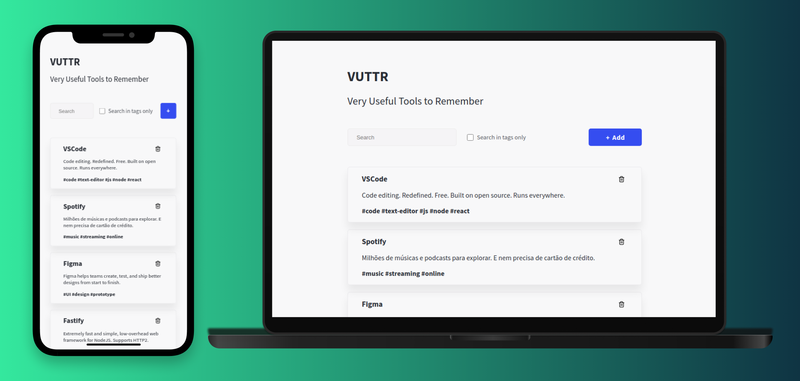

<h1 align="center">⚙️ VUTTR</h1>

Very Useful Tools to Remember

  
  
  
  
  

Tabela de conteúdos
=================
<!--ts-->
   * [Sobre](#Sobre)
   * [Tabela de Conteudo](#tabela-de-conteudo)
   * [Instalação](#instalacao)
   * [Como usar](#como-usar)
      * [Pre Requisitos](#pre-requisitos)
      * [Local files](#local-files)
      * [Remote files](#remote-files)
      * [Multiple files](#multiple-files)
      * [Combo](#combo)
   * [Tests](#testes)
   * [Tecnologias](#tecnologias)
<!--te-->

### Features

- [x] Buscar por ferramenta ou tag de ferramentas
- [x] Cadastro de nova ferramenta
- [x] Deletar ferramenta

