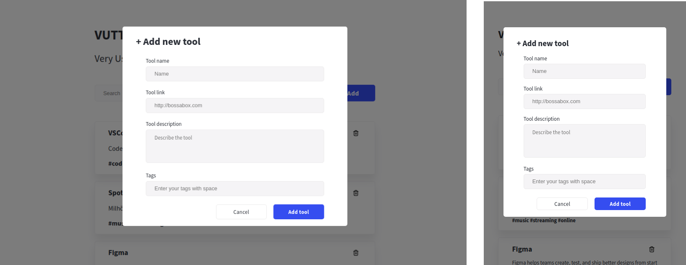
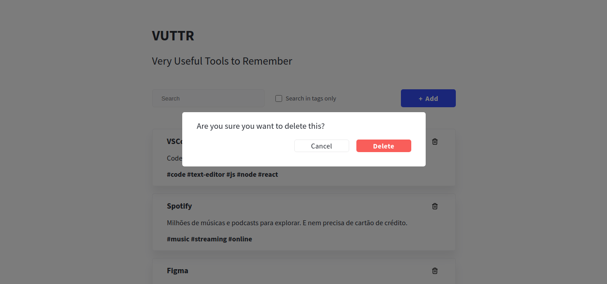

<h1 align="center">⚙️ VUTTR - Very Useful Tools to Remember</h1>
<p align="center">Uma aplicação para gerenciar ferramentas úteis no seu dia a dia</p>

<p align="center">
  
  
  
  
  <a href="https://github.com/Rocketseat/live-graphql/stargazers">
    
  </a>
</p>

<p align="center">
 <a href="#sobre">Sobre</a> •
 <a href="#instalação-e-execução">Instalação e execução</a> •
 <a href="#screenshots">Screenshots</a>
</p>


## 📖 Sobre

O repositório é um desafio da [BossaBox](https://bossabox.com/para-profissionais), para demostrar meus conhecimentos de front-end.
Escolhi usar [React](https://pt-br.reactjs.org/).

*Com essa app podemos:*
- [x] Buscar por ferramenta ou tag
- [x] Cadastrar uma nova ferramenta com link, descrição e tags
- [x] Deletar ferramentas

## 💽 Instalação e execução

### ✅ Pré-requisitos

Para começarmos, você precisa já ter instalado na sua máquina o:
[Git](https://git-scm.com), o [Node.js](https://nodejs.org/en/) e o [NPM](https://www.npmjs.com/) ou [Yarn](https://yarnpkg.com/)

### 🎲 Back-end

*No desafio, foi disponibilizada uma API pronta em NodeJS*

  1. Clone o repositório da API```$ git clone <https://gitlab.com/bossabox/challenge-fake-api/tree/master>```
  2. Entre na pasta do projeto e instale as dependências ```cd challenge-fake-api && yarn``` ou ```cd challenge-fake-api && npm i```
  3. Rode ```npx json-server db.json``` para inicializar o servidor
  *servidor inciará na porta:3000*
  
### 👨‍💻 Front-end

  1. Clone esse repositório
  2. Acesse a pasta do projeto e instale as dependências ```cd vuttr && npm i```
  3. Rode ```npm start``` ou ```yarn start```
  
  *Como o back-end está na porta 3000, você deverá aceitar que o front-end rode em outra*
  
## Screenshots

### Adicionar ferramenta



### Remover ferramenta


